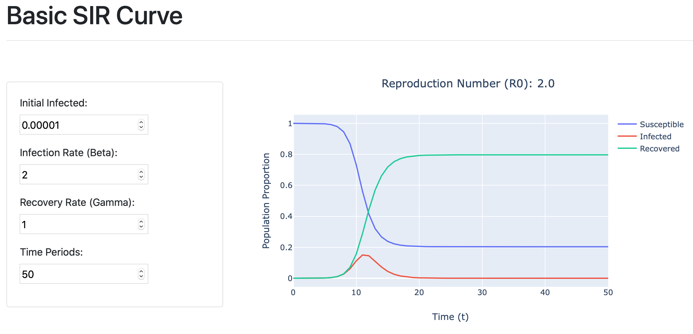

# Basic SIR Chart

Basic implementation of the [SIR Model](https://en.wikipedia.org/wiki/Compartmental_models_in_epidemiology) (Suspectible, Infected, Recovered), allowing interaction with the infection & recovery rates to see how they impact the reproductive ratio & epidemic curves.

Sample available at: https://simple-sir-model.herokuapp.com/

## Usage

1. Install required packages
```bash
pip install -r requirements.txt
```

2. Run the app
```bash
python app.py
```


## Example

